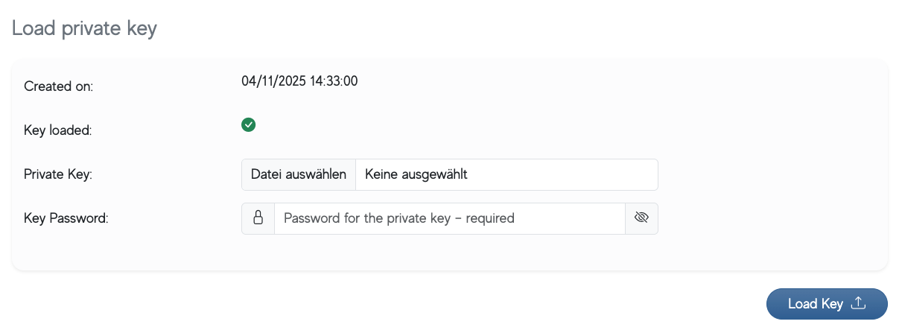

# Task-Kit Explanation
For further details and explanations, please refer to my Notion page:
https://educated-mine-3c7.notion.site/BHV-3216ca9baec180829438d30f0a63144e


Additionally, I spent some extra time quickly studying cryptography and organizing it into notes:
Symmetric Encryption
https://educated-mine-3c7.notion.site/Symmetric-Encryption-3226ca9baec1804686c8c38b75c83346

Asymmetric Encryption
https://educated-mine-3c7.notion.site/Asymmetric-Encryption-3226ca9baec180b0b61acd28655f2e7c

PGP/GPG
https://educated-mine-3c7.notion.site/PGP-GPG-3216ca9baec1801b85fad21f62d38d82

Zero Knowledge
https://educated-mine-3c7.notion.site/Zero-Knowledge-3226ca9baec180cfa98dd12d4ccf2a60


# Task-Kit
## Introduction
In one of our projects, we are using client side encryption with zero-knowledge. Each user has its own private/public keypair that is used to do the encryption in the browser. The keypair is loaded into the browser and then used for encrypt and streaming data at the same time using openpgp.js.

## Task
Load the private key into the browser for future decryption usage. If you want to use a different approach (eg. drop the form, changing id's or classes for event binding etc.) - you are free to do so. No data should be send to the server, especially the key!

## Requires
* nvm (suggestion)
* Node.js 22

## Packages used
* OpenPGP 5.11.3
* JQuery 3.7.1
* Bootstrap 5.3.3 (with our colors pre-build)
* NPX 10.x as Server

## Starting the project
```bash
nvm use 22 # can be skipped if node 22 is already installed
./start.sh
```

## Key to use
Private key can be found in ./materials. It is protected with 'test1234'

## End result
The result should look like this:


